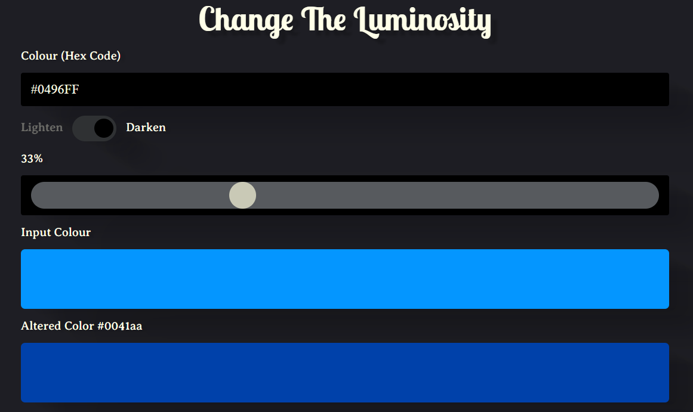

# Change The Luminosity

My take on Scrimba's Color Tool: [Build a color tool in vanilla JavaScript](https://scrimba.com/learn/javascriptcolortool).

## Project requirements: 

1. Takes a user inputted hex code, which can entered with or without a **#** and must be either **3 or 6 characters of 0-9 and/or a-f**. This colour is then displayed on the page.
2. A **toggle** button lets the user choose to lighten or darken the colour. Labels are de-emphasized when not toggled.
3. A **range slider** determines how much to alter the colour, showing the current percentage. 
4. The tool uses JavaScript to **convert the hex code to rgb**, alter by the given percentage, **converted back from rgb to hex** and displayed on the page.

## Extra features
1. Chose a dark palette to emphasize displayed colours and added box shadows for texture.
2. Created gradient on range slider for extra visual clues for how to use. Changed gradient when toggle switched with `.root {--gradient: linear-gradient(90deg, rgba(0,0,0,1) 0%, rgba(87,90,94,1) 60%, rgba(213,213,219,1) 100%);
}` and **event listener** on toggle button using `root.style.setProperty`.
3. Drew attention to outputted hex code by placing in `` and adjusting CSS with `#alteredColorText {
    padding: 0 1em;
    font-size: 1.35em;
}`.
4. Used `clamp` on `font-size` and `.container` to make responsize. Added border around toggle button for mobile screens. 
5. Added **copy button** for user to copy outputted hex to their clipboard: `copyBtn.addEventListener("click", async () => {
    await navigator.clipboard.writeText(alteredHex);
    alert(`Hex code ${alteredHex} was copied to your clipboard`)
});`
6. Made **accessibility** improvements using `tabindex` and `aria-roledescription`. Added focus and hover states for all interactive page elements.

.

Go to the [Live Site](https://jolenekearse.github.io/color_tool/)
